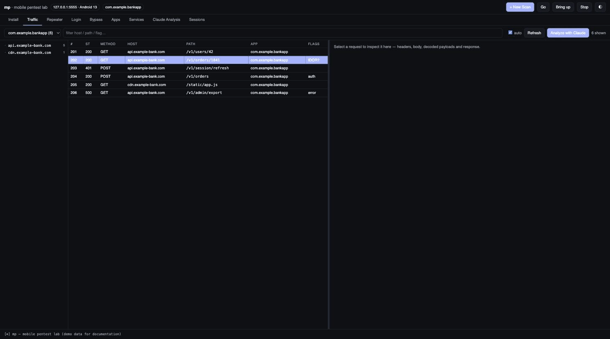
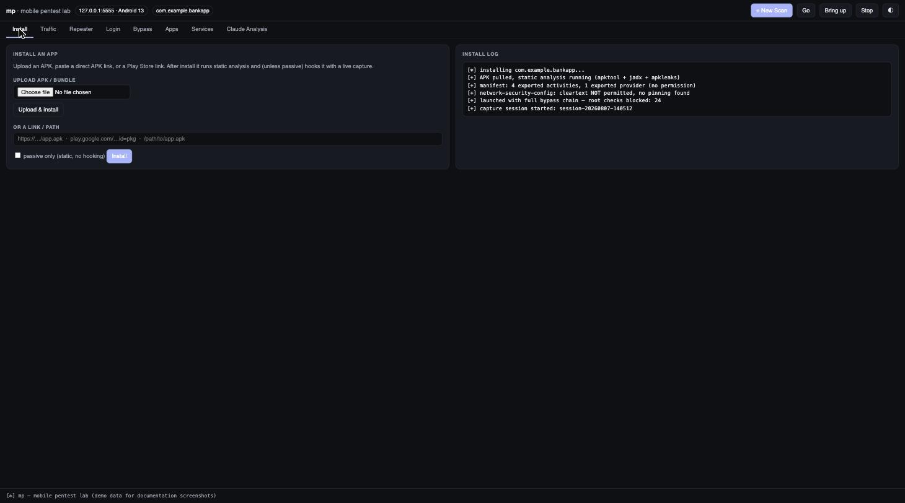
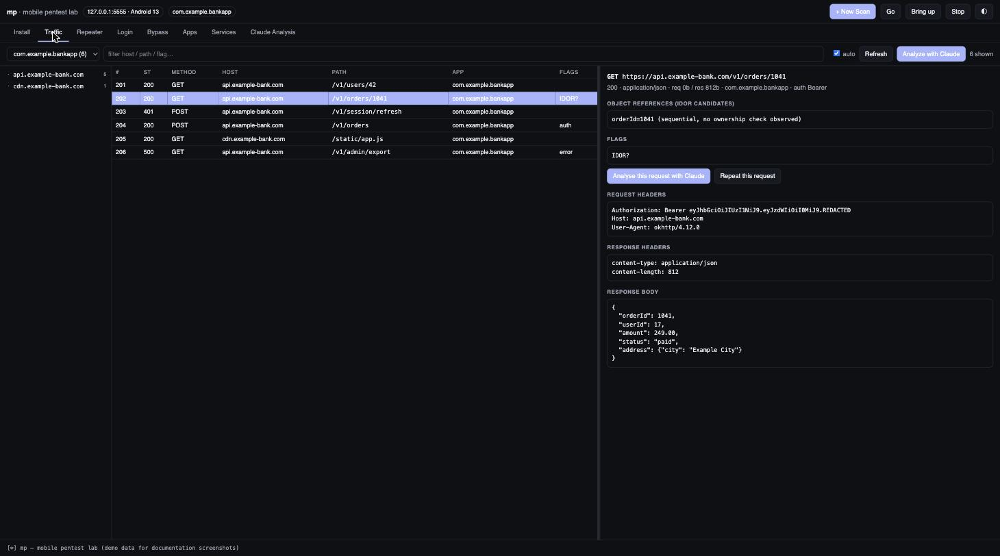
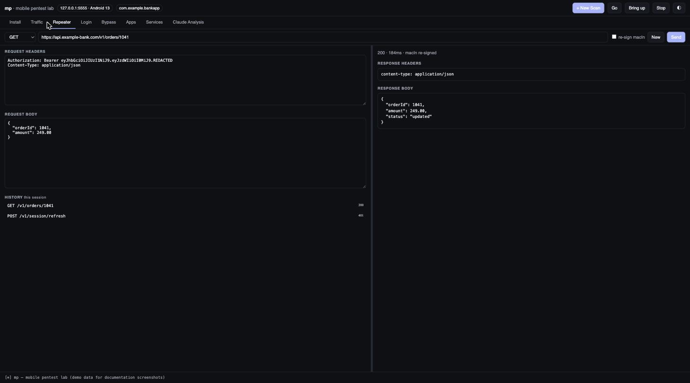
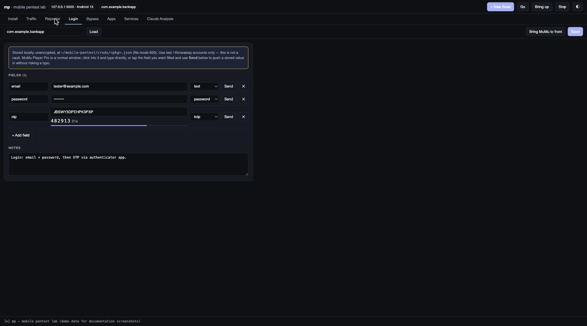
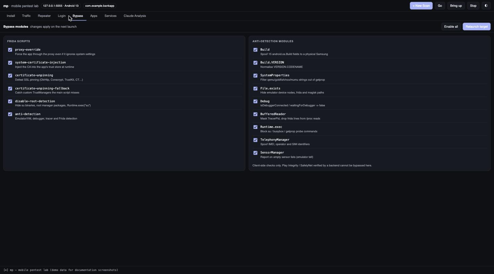
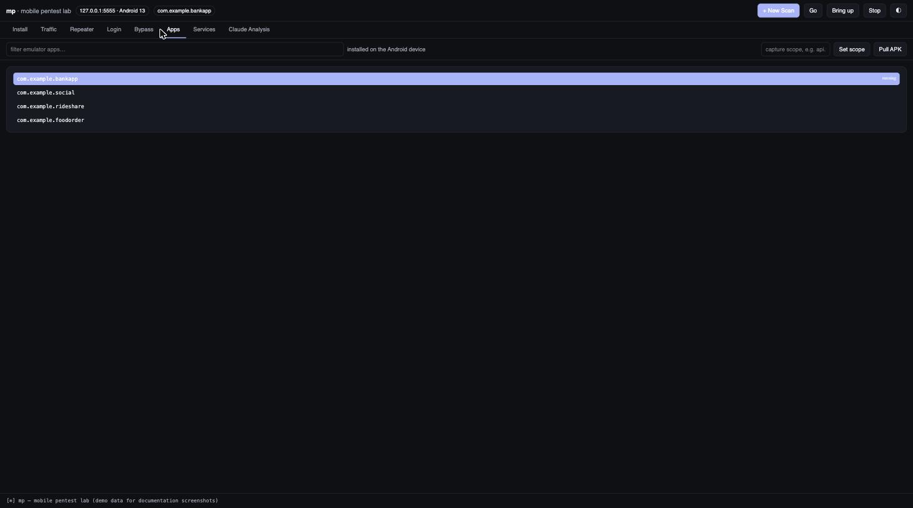
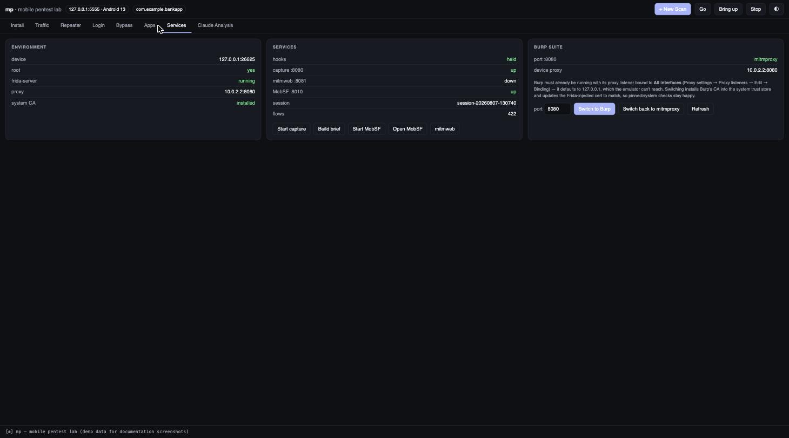
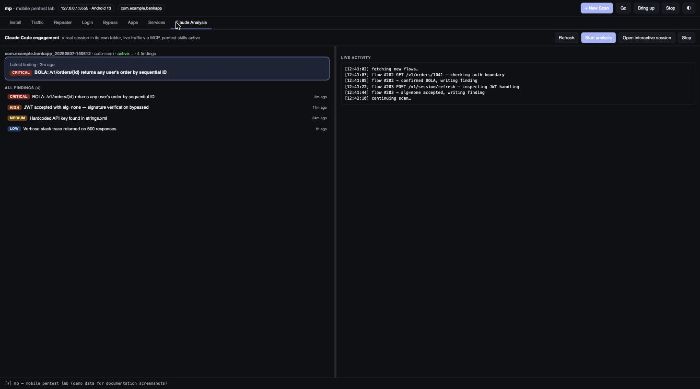
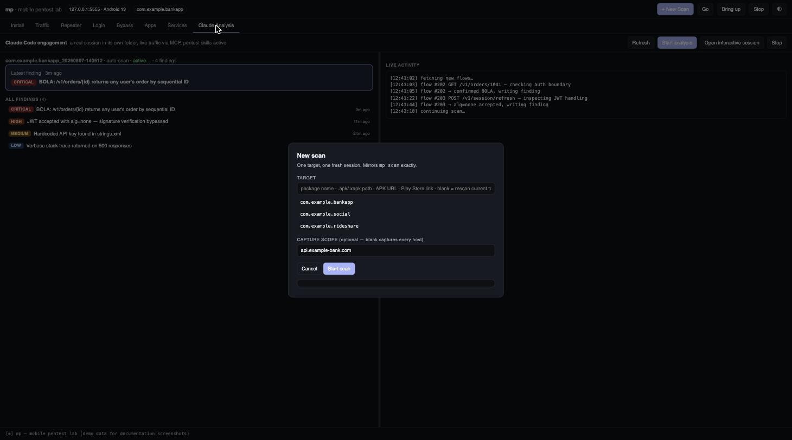

# Mobix

**An Android pentest lab you can drive by hand or hand to an AI agent.**

Root+SSL-pinning bypass, live traffic capture, and a web dashboard are the
table stakes — plenty of Frida wrappers do that. What's different: a 36-tool
MCP control plane means a Claude Code session can run the whole loop itself —
scan an app, watch its traffic, flag IDOR candidates automatically, write
evidence-backed findings — while staying inside a hard-coded read-only
allowlist for the unattended path. One line to install, one command to scan.

<p align="center">
  <a href="https://github.com/blackfoxxx/Mobix/blob/master/LICENSE"></a>
  
  
  <a href="https://github.com/blackfoxxx/Mobix/stargazers"></a>
</p>

<p align="center">
  
</p>

> Synthetic demo app/traffic/findings throughout — no real target data. See
> [Screenshots](#screenshots) below for the full set, one per tab.

**If this is useful to you, a ⭐ helps other pentesters find it — genuinely
appreciated.**

<details>
<summary><b>Contents</b> (click to expand)</summary>

- [Installing](#installing)
- [Starting a scan](#starting-a-scan)
- [Switching to Burp from the dashboard](#switching-to-burp-from-the-dashboard)
- [Web dashboard](#web-dashboard)
- [Screenshots](#screenshots)
- [Quick start — the `mp` command](#quick-start--the-mp-command)
- [Device](#device)
- [Layout](#layout)
- [Underlying scripts](#underlying-scripts)
- [Scripts](#scripts)
- [Interception: three layers](#interception-three-layers)
- [Using Burp instead of mitmproxy](#using-burp-instead-of-mitmproxy)
- [Feeding traffic to Claude Code](#feeding-traffic-to-claude-code)
- [Where the requests are](#where-the-requests-are)
- [Web pentest with Burp](#web-pentest-with-burp)
- [Inspecting one app's traffic](#inspecting-one-apps-traffic)
- [Claude Code engagements (`mp engage`)](#claude-code-engagements-mp-engage)
- [Sessions & resuming](#sessions--resuming)
- [Logging in](#logging-in)
- [Site map & Repeater](#site-map--repeater)
- [Wiring traffic into Claude Code (lightweight)](#wiring-traffic-into-claude-code-lightweight)
- [Static analysis](#static-analysis)
- [Runtime exploration](#runtime-exploration)
- [Installing an app](#installing-an-app)
- [Switching apps](#switching-apps)
- [Apps that refuse to run on a rooted device](#apps-that-refuse-to-run-on-a-rooted-device)
- [Gotchas](#gotchas)
- [Scope discipline](#scope-discipline)

</details>

## Installing

One line, on a fresh machine — clones this repo to `~/mobile-pentest` (override
with `MP_ROOT=/some/path`), then runs the installer below:

```bash
curl -fsSL https://raw.githubusercontent.com/blackfoxxx/Mobix/master/scripts/bootstrap.sh | bash
```

Already cloned it yourself? Run the installer directly instead:

```bash
scripts/install.sh      # installs everything this lab depends on
mp doctor                # verifies it actually works (not just "present")
```

- **macOS** — fully supported, the only tested target. Installs Homebrew
  (if missing), all formulae/casks (jadx, apktool, dex2jar, scrcpy, coreutils,
  fzf, jq, openssl, android-platform-tools, mitmproxy, Docker), pins
  `frida`/`frida-tools`/`objection` to the exact version this repo's bundled
  `bin/frida-server-*-arm64` needs, installs `cryptography` (needed by any
  target-specific request-signer you write — see
  [Re-signing custom request-integrity fields](#re-signing-custom-request-integrity-fields)),
  and symlinks `mp` onto `PATH`. It does **not** install MuMu Player Pro
  itself (not distributed via Homebrew) — grab it from the vendor and root it
  first. Safe to re-run any time; every step is install-if-missing.
- **Linux** — **partial install only.** The portable tooling (adb, frida,
  jadx, apktool, mitmproxy, Docker) installs via apt/dnf/pacman, but MuMu
  Player Pro is macOS-only and so is this lab's automation layer (`mp engage`,
  `creds.py front`, the LaunchAgent keepalive — all built on `osascript` /
  `launchctl`). On Linux you drive some other adb-reachable rooted device or
  emulator by hand with `adb`/`frida`/`objection`; `mp` itself runs but
  anything that shells out to MuMu-specific automation will fail.
- **Windows (native)** — not supported; the script exits with instructions to
  use WSL2 and take the Linux path from inside it (a real device/emulator is
  still needed — MuMu won't run under WSL2 either).

`mp doctor` (`scripts/selftest.sh`) checks host tool versions, the frida
CLI-vs-device-server version match (and warns about shadow pipx installs that
could silently take over `PATH`), `cryptography` importability on whatever
`python3` resolves to, live device root + `/system` writability, an actual
frida handshake, Docker/MobSF health, and MCP registration — everything
"present" doesn't already mean "working." Use `mp doctor --quick` to skip the
device-dependent checks when no emulator is booted.

## Starting a scan

**`mp scan`** is the one command to reach for — CLI and dashboard both funnel
through it now, so there's a single, predictable flow no matter where you
start from:

```bash
mp scan                      # no target chosen -> opens the app picker
mp scan com.target.app        # an already-installed app (fuzzy name OK)
mp scan app.apk                # or a .apk/.xapk/.apkm/.apks file
mp scan https://host/app.apk   # or a direct APK URL
mp scan 'play.google.com/...id=pkg'   # or a Play Store link
```

Every path converges on the same four numbered steps, always printed the same
way:

```
[1/4] environment   emulator up, frida-server running, CA installed
[2/4] target         resolved package (installed / fuzzy-matched / installed-then-set)
[3/4] capture        FRESH session, scope printed explicitly (or a warning if empty)
[4/4] app             launched hooked - root checks blocked, SSL unpinning active
```

It always starts clean: force-stops whatever was hooked before, never
silently reuses a stale capture. If the scope is empty it says so loudly
(`⚠ no scope set -> capturing ALL hosts`) rather than leaving that state
invisible — that ambiguity was the root of more than one earlier mix-up. If a
name matches more than one installed app it lists every match and asks you to
be specific rather than guessing.

`mp scan` is a thin front door over lower-level building blocks (`mp go`,
`mp switch`, `mp install`, `mp launch`) that still exist for scripting or
finer control — see `mp help`, under **BUILDING BLOCKS**. You don't need them
for normal use.

**Note:** `mp scan` used to mean *static APK analysis*. That's now
**`mp static [apk]`** — the old name was a collision with what people actually
reach for when they mean "start a scan session," which was the source of a lot
of the confusion this redesign fixes.

## Switching to Burp from the dashboard

The **Services** tab has a **Burp Suite** card mirroring `mp burp`/`mp burp
--mitm`: a live status line (which process actually owns the proxy port —
mitmproxy, Burp, or something else — plus what the device is currently
pointed at), a port field, and **Switch to Burp** / **Switch back to
mitmproxy** buttons. Same prerequisite as the CLI: Burp's listener has to be
bound to **All interfaces** first, or the emulator can't reach it.

**Switching to Burp stops whatever capture is currently running on that
port as its first step**, before it even checks whether Burp is up — so
don't click it mid-capture unless you mean to end that session. Switching
back to mitmproxy is safe to click anytime; it only updates the injected
cert, it doesn't touch a running capture.

## Web dashboard

```bash
mp dash            # http://127.0.0.1:8090
```

Nine tabs:

**Install** — upload an APK/bundle or paste a link/Play Store URL; runs static
analysis and (unless passive) hooks it with a live capture. Log streams on the
right.

**Traffic** — master/detail inspector with a draggable splitter, plus a
host/path tree on the left to filter by API surface. Click any request to see
its headers, pretty-printed request and response bodies, decoded base64
payloads (`requestBody` / `responseBody` are unwrapped automatically), flags
and IDOR candidates. Free-text filter plus a per-app dropdown. You do not need
to open mitmweb for normal inspection.

**Repeater** — edit method/URL/headers/body and resend directly from the Mac
(no device hop). Auto-detects a `macIn`-style integrity field and offers to
re-sign it. Keeps the last 25 sends this session.

**Login** — stored per-app credential fields (text/password/TOTP with a live
code), "Send" pushes a value into whatever field is focused in MuMu.

**Bypass** — a checkbox per module, with descriptions. Six Frida scripts
(proxy override, cert injection, unpinning, unpinning fallback, root detection,
anti-detection) and the nine anti-detection sub-modules (Build spoofing,
SystemProperties, File.exists, Debug, BufferedReader, Runtime.exec,
TelephonyManager, SensorManager). Toggles persist to `bypass.json` and apply on
the next launch; **Relaunch target** is right there. Turning a script off drops
its `-l` flag; turning an anti-detection module off writes it into
`ANTI_DETECT_SKIP` in `config.js`.

**Apps** — emulator packages with running markers, click to set the target,
plus scope entry and Pull APK.

**Services** — environment and service state, MobSF/Burp controls, with the
remaining actions.

**Claude Analysis** — the live findings list from an `mp engage` run (interactive
or `--auto`), with a hero card for the latest finding and a live-activity feed.
See [Claude Code engagements](#claude-code-engagements-mp-engage).

**Sessions** — every past capture session and Claude Code engagement, browsable
read-only, forever — a new scan never deletes anything. See
[Sessions & resuming](#sessions--resuming) below.

The **Emulator apps** panel lists packages installed on the *Android device*
(`pm list packages -3`), marks which are running, and sets the target on click.
It never shows host/macOS applications — the lab only ever targets the emulator.

**Bound to `127.0.0.1` only, deliberately.** The dashboard can run `mp`
commands, so exposing it on a routable interface would hand the whole toolkit to
anyone who can reach it. Actions are a fixed whitelist and package/scope
arguments are regex-validated, but do not put it behind a tunnel or bind it to
`0.0.0.0`.

## Screenshots

All of the below use a synthetic demo app (`com.example.bankapp`) with fabricated
traffic and findings — none of this is real target data.

<table>
<tr>
<td width="33%"><br><sub>Install — upload/link an APK, static analysis + capture starts automatically</sub></td>
<td width="33%"><br><sub>Traffic — host tree, request list, decoded detail pane</sub></td>
<td width="33%"><br><sub>Repeater — edit and resend, with macIn re-signing and history</sub></td>
</tr>
<tr>
<td width="33%"><br><sub>Login — stored test creds incl. live TOTP, push into a focused field</sub></td>
<td width="33%"><br><sub>Bypass — Frida scripts and anti-detection modules, toggle per launch</sub></td>
<td width="33%"><br><sub>Apps — installed packages, click to set target</sub></td>
</tr>
<tr>
<td width="33%"><br><sub>Services — environment status, capture/MobSF controls, Burp switch</sub></td>
<td width="33%"><br><sub>Claude Analysis — live findings by severity, latest-finding hero card</sub></td>
<td width="33%"><br><sub>New scan — one target, one fresh session, mirrors <code>mp scan</code></sub></td>
</tr>
</table>

## Quick start — the `mp` command

Everything runs through `mp` (on `PATH` via `/opt/homebrew/bin/mp`). Pick a
target app once; every other command then applies to it.

```bash
mp apps          # fzf picker over installed apps -> sets the target
mp scope api.target.com   # optional: limit capture to these hosts
mp go            # everything: boot emulator, hook target, start capture
#   ... drive the app by hand ...
mp analyze       # build the Claude-readable feed from the newest session
mp stop          # end hooks + capture
```

`mp go` needs **nothing** running beforehand. From a completely stopped
emulator it boots MuMu, waits for Android, starts frida-server, sets the proxy,
repairs the system CA if missing, launches the target with root + SSL bypasses,
and starts a scoped capture — about 40 seconds end to end. `mp up` does the same
without launching the app.

Optional extras with `mp auto mobsf-on` (starts MobSF as part of `mp up`).

`mp status` shows device, root, frida-server, proxy, CA, target, hooks, capture
and MobSF on one screen. `mp help` lists everything.

The target and scope persist in `~/mobile-pentest/config`, so they survive
reboots and you only choose once per engagement.

### Persistence

A LaunchAgent (`com.aj.mobilepentest.keepalive`) runs `bin/mp-keepalive` every
60 seconds. The CA lives on `/system` and survives on its own, but frida-server
and the device proxy setting do not survive an emulator restart — the agent
notices and restores both, logging to `loot/keepalive.log`. It deliberately does
**not** relaunch your target app; hooking an app is an explicit act.

To disable: `launchctl unload ~/Library/LaunchAgents/com.aj.mobilepentest.keepalive.plist`

## Device

| | |
|---|---|
| Serial | `emulator-5554` (ADB also on `localhost:5555`) |
| Model / OS | SM-S9180, Android 12 (SDK 32) |
| ABI | `arm64-v8a` — native ARM, so stock ARM tooling and ARM-only APKs run without translation |
| Root | `adbd` runs as **uid 0**; `/system/bin/su` present (no Magisk) |
| SELinux | **Permissive** |
| `/system` | mounted **read-write** — system CA certs install directly |
| Device IP | `10.0.2.15/24`, gateway `10.0.2.2` |

**Host address from the device: `10.0.2.2`.** The Mac's LAN IP (`192.168.0.184`) also
works but changes with the network; `10.0.2.2` does not. Everything is configured
against `10.0.2.2`.

## Layout

```
~/mobile-pentest/
├── scripts/         operator scripts (below)
├── frida-scripts/   httptoolkit unpinning suite + config.js (CA + proxy baked in)
├── bin/             mp / mp-dashboard / mp-mcp + frida-server (fetched by install.sh, not committed)
├── apks/            pulled APKs, one dir per package (gitignored - not source)
└── loot/            captured flows, static-analysis output, MobSF data (gitignored - not source)
```

## Underlying scripts

`mp` is a thin front end over `scripts/`. Use these directly when you want
finer control; each is independently runnable.

Each capture creates `loot/session-<timestamp>/` containing both the raw flows
and an analysis feed built for Claude Code to read — see
[Feeding traffic to Claude Code](#feeding-traffic-to-claude-code).

## Scripts

| Script | Purpose |
|---|---|
| `start-env.sh` | Starts frida-server, sets the global proxy, verifies root + CA. Run after every emulator reboot. |
| `capture.sh [web\|dump\|proxy\|wg]` | Starts mitmproxy on `0.0.0.0:8080` **and the Claude analysis feed**. `web` = browser UI (default), `dump` = headless, `proxy` = TUI, `wg` = WireGuard VPN mode. |
| `analyze.sh <flows.mitm> [scope]` | Converts a saved flow file into the analysis feed offline. |
| `proxy.sh on\|off\|status` | Toggles the device-wide HTTP proxy. Turn **off** before using WireGuard mode. |
| `launch.sh <pkg>` | **Detached** launch with the full bypass chain — no terminal to keep open. Use this for apps with root detection. `--stop` / `--log` to manage. |
| `hook.sh <pkg> [--attach]` | Same chain but an interactive Frida REPL, for when you want to poke at the runtime live. |
| `install-ca.sh <cert>` | Installs any PEM/DER CA into the **system** trust store. |
| `install-burp-ca.sh [port]` | Pulls Burp's CA from a running Burp and installs it system-wide. |
| `pull-apk.sh <pkg>` | Pulls base + split APKs into `apks/<pkg>/`. |
| `static-scan.sh <apk>` | apktool + jadx + apkleaks; reports manifest flags, exported components, network-security-config, pinning call sites, native libs. |
| `mobsf.sh start\|stop\|logs` | MobSF at http://127.0.0.1:8010 (creds `mobsf/mobsf`). Port 8010 because 8000 is used by your `tengu` container. |
| `install.sh` | Installs every host dependency — full on macOS, tooling-only on Linux, refuses on native Windows. Safe to re-run. |
| `selftest.sh` | `mp doctor` — verifies every dependency actually *works* (versions match, device handshake succeeds, CA store writable), not just that it's installed. |

## Interception: three layers

The layers are cumulative — each catches what the previous one misses.

**1. System CA (installed).** mitmproxy's CA is in `/system/etc/security/cacerts`,
so apps trust it even when they ignore user-installed certs — which every app
targeting API 24+ does by default. Verified working against Google's own
`play-fe.googleapis.com` and every target app tested so far — traffic decrypts
cleanly without any app-side pinning changes.

**1b. Detection bypasses.** Loaded with every launch:
`android-disable-root-detection.js` (su binaries, root manager packages,
`Runtime.exec("su")`) and `android-anti-detection.js`, which covers emulator/VM
tells (15 `android.os.Build` fields spoofed to a Samsung SM-S928B, `getprop`
filtered for qemu/goldfish/nox/mumu strings, emulator device nodes hidden from
`File.exists`), debugger and tracer checks (`Debug.isDebuggerConnected`,
`TracerPid` masked in `/proc` reads), Frida artefacts (agent lines dropped from
`/proc/self/maps` reads, `frida*` paths hidden), plus spoofed telephony
identifiers so an emulator's blank IMEI/operator does not give it away.

Each module reports `[anti-detect] ok: <name>`. If a defensive app dies on
launch, bisect by setting `ANTI_DETECT_ONLY` or `ANTI_DETECT_SKIP` in
`frida-scripts/config.js`:

```js
var ANTI_DETECT_ONLY = ['Build','SystemProperties'];   // enable only these
var ANTI_DETECT_SKIP = ['BufferedReader'];             // or drop just one
```

**Honest limit:** these defeat *client-side* checks only. Play Integrity or
SafetyNet verified by a backend cannot be bypassed here — the verdict is signed
by Google and checked off-device.

**2. Frida unpinning (`launch.sh` / `hook.sh`).** Defeats apps that pin. The chain hooks
`HttpsURLConnection`, `SSLContext.init`, Conscrypt `CertPinManager`,
`NetworkSecurityConfig`, OkHttp `CertificatePinner` + `OkHostnameVerifier`,
TrustKit, Cordova/Worklight/Netty/appmattus CT — plus a fallback auto-patcher
that catches custom `TrustManager`s at runtime, a proxy override for apps that
ignore system proxy settings, and root-detection bypass.

**3. WireGuard mode (`capture.sh wg`).** The fallback for apps that bypass the
HTTP proxy entirely (raw sockets, custom DNS, gRPC). mitmproxy prints a
WireGuard config; import it into a WireGuard client on the device. Turn the
global proxy **off** first — don't stack layers 1 and 3.

## Using Burp instead of mitmproxy

1. In Burp: **Proxy → Proxy settings → Proxy listeners → Edit → Binding → All interfaces.**
   Burp binds to `127.0.0.1` by default and the emulator cannot reach that.
2. Stop mitmproxy so port 8080 is free (or run Burp on another port and set
   `MP_PROXY_PORT` to match).
3. `./scripts/install-burp-ca.sh 8080`
4. Re-run the `config.js` cert step if you want Frida's runtime cert injection to
   use Burp's CA too — replace `CERT_PEM` in `frida-scripts/config.js`.

## Feeding traffic to Claude Code

Raw flows are far too large and too noisy to hand to an LLM — a single session is
megabytes of images, bundles and protobuf. `scripts/mpfeed.py` is a mitmproxy
addon that rides along with every capture and distils the traffic into something
readable. It runs automatically; you don't invoke it directly.

Every capture writes `loot/session-<timestamp>/`:

| File | What it's for |
|---|---|
| `index.md` | One line per request. **Skim this first.** |
| `surface.md` | Endpoints collapsed into templates (`/users/{id}`), with hit counts, status distribution, and authed-vs-unauthenticated split. This is the attack surface. |
| `flags.jsonl` | Auto-detected JWTs (with claims decoded), API keys, credentials, PII, card numbers. |
| `flows.jsonl` | Full detail, one JSON object per flow — `grep`/`jq` this. |
| `flows.mitm` | Raw flows, replay with `mitmweb -r`. |

Then just point me at it:

> "Analyse `~/mobile-pentest/loot/session-20260805-164934/`"

**Scope it to your target** so out-of-scope apps aren't captured or analysed:

```bash
MP_SCOPE=api.target.com,cdn.target.com ./scripts/capture.sh dump
```

**Already have a flow file?** Convert it offline:

```bash
./scripts/analyze.sh loot/session-*/flows.mitm api.target.com
```

What it does for you automatically:

- Drops images, fonts, CSS/JS, media and binary blobs — only meaningful traffic survives.
- Truncates bodies to 4 KB (`MP_MAX_BODY` to change).
- Decodes JWT claims inline, so `role`, `sub` and `exp` are visible without you pasting tokens into a decoder.
- Collapses `/users/4821` and `/users/9930` into one `/users/{id}` endpoint, and lists the concrete IDs as **IDOR candidates**.
- Flags every endpoint that returned 2xx with **no** `Authorization` or `Cookie` header — the fastest route to a broken-access-control finding.

Detector accuracy was tuned against real traffic: millisecond epoch timestamps
are no longer mistaken for Luhn-valid card numbers, version strings are no
longer mistaken for emails, and noisy detectors (UUID, ObjectId, email, phone)
only fire when the match is properly delimited rather than sliced out of a
base64 blob. Each detector is capped at 3 hits per flow so one chatty request
can't flood the file.

## Where the requests are

`mp log` shows **Frida hook diagnostics** (`=> com.android.okhttp.Address $init …`)
— that is the unpinning chain reporting each hooked call, not your traffic.

The HTTP requests live in the capture session:

```bash
mp req            # last 25 requests, readable
mp req -f         # follow live as you use the app
mp req 100        # last 100
mp web            # open the flows in the mitmweb UI (browse / edit / replay)
```

`mp req` asks the running proxy where it is actually writing, rather than
assuming the newest directory — those differ whenever a capture was reused.

Full detail per request is in `loot/session-*/flows.jsonl` (one JSON object per
flow: headers, bodies, IDOR candidates, flags). `index.md` is the skim view,
`surface.md` the endpoint rollup.

## Web pentest with Burp

For Repeater / Intruder / Scanner, hand the traffic to Burp:

1. Start Burp. **Proxy → Proxy settings → Proxy listeners → Edit → Binding →
   All interfaces.** Burp binds to `127.0.0.1` by default and the emulator
   cannot reach that.
2. `mp burp` — stops mitmproxy, pulls Burp's CA through the running listener,
   installs it into the system store, updates `frida-scripts/config.js` so the
   runtime injection uses Burp's CA too, and repoints the device.
3. `mp launch` — relaunch the app so the new CA is injected.

`mp burp --mitm` switches back.

### Re-signing custom request-integrity fields

Some APIs attach a custom integrity/MAC field to every request body (hashed
and signed with a key extracted from the app), so editing a body in Repeater
invalidates it. The pattern is generally: canonicalise the fields the app
signs, hash them, then encrypt/sign with the key pulled from the decompiled
APK or its native libs. This lab doesn't ship a target-specific signer since
the exact fields/algorithm differ per app — write a small `scripts/<target>-
resign.py` following that shape and both `brief.py` and the dashboard's
Repeater will pick it up automatically if you wire it in next to
`zc-macin.py`'s loading pattern.

This is possible **because** of finding ZC-1 — the MAC is RSA-encrypted with a
*public* key embedded in the app, so anyone can mint a valid one.

Worth trying first: send a modified body **without** touching `macIn`. The app
itself computes the MAC over a freshly generated `requestID`/`requestTime` that
differ from what it transmits, yet the server still accepts those requests —
strong evidence `macIn` is not verified strictly, or at all. Which answer you
get is itself the finding.

## Inspecting one app's traffic

Every capture records **which app was hooked** when each flow was seen, so the
UI can be filtered down to a single app instead of the whole device.

```bash
mp seen                      # which apps produced traffic in this session
mp web                       # picker over those apps -> opens filtered mitmweb
mp web tv.app1001.android     # skip the picker
mp web '*'                   # everything, unfiltered
```

`mp web` derives the app's hosts from the session and builds a mitmweb view
filter (`~d api\-gateway\.1001\.tv`). Note that mitmproxy treats `(`, `)` and
`|` as **filter-language operators**, not regex — `~d (a|b)` is a syntax error,
so the filter is emitted as `~d a | ~d b` with dots escaped.

**How attribution works, and its limit.** The emulator NATs every app behind one
address, so per-connection attribution is not available. Instead `launch.sh`
records the hooked package in `.active-app` and the capture feed tags each flow
with it — the honest unit is *"captured while app X was hooked"*. Traffic from
background OS services during that window is tagged the same way. Combine with
`mp scope <host>` when you need certainty about which traffic is really the
target's.

## Claude Code engagements (`mp engage`)

Beyond one-shot analysis, `mp engage` starts a **full Claude Code session** for a
target — its own folder, live traffic wired in via MCP, and the pentest
skills/plugins active exactly as in a hand-started session.

```bash
mp engage                 # interactive session in a new Terminal, in the target folder
mp engage <pkg> --auto    # headless agent: reviews the live capture, writes findings
mp engage --stop          # stop running agents
```

Each run creates `engagements/<pkg>_<timestamp>/` seeded with:
- `CLAUDE.md` — target, scope, authorisation, and how to reach the live traffic tools
- `traffic/` — symlink to the live capture session; `BRIEF.md` snapshot
- `findings/` — where the agent writes one report per issue

The dashboard's **Claude Analysis** tab tracks BOTH modes live, including an
**interactive session you're driving by hand in Terminal** — it polls
`engagements/<latest>/findings/` regardless of who's writing to it, sorts newest
first (not alphabetically, so a fresh Critical isn't buried under older Lows),
and shows a **Latest finding** card at the top with severity and age. A small
dot appears on the **Claude Scan** nav tab whenever a new finding lands while
you're looking elsewhere, and opening the tab jumps straight to it.

**Interactive mode** opens a real `claude` session in Terminal.app in that
folder — full skills, plugins, permissions, MCP. **`--auto` mode** runs a
headless agent (analysis-only allowlist: the `mp-traffic` MCP tools + Read/Write/
Grep/Skill, **no Bash, no request sending**) that streams events to `scan.log`
and writes findings as it goes.

The **Claude Analysis** tab in the dashboard drives both: Start analysis / Open
interactive / Stop, a live findings list with a reader, and the agent's current
activity. The Traffic tab's **Scan with Claude** button starts an auto-scan on
the current session.

In a real engagement the auto agent produced 8 findings
unattended — BOLA/IDOR on ObjectId-addressed endpoints, HS256 JWT carrying PII,
mass assignment, wildcard CORS, unauthenticated CodePush OTA — each with
evidence flow numbers and a read-only confirmation test.

Note: the agent's first message can trip the broad model safeguard on
cyber-security phrasing; it auto-falls-back to another model and continues. The
prompt is framed as a security review of already-captured data to minimise this.

## Sessions & resuming

Every `mp scan`/`mp switch` starts a **fresh** capture session — but never
deletes the old one. `loot/session-<timestamp>/` directories accumulate
forever (clean them up by hand if disk space matters); nothing in this lab
ever removes a past session automatically.

**Dashboard.** The **Sessions** tab lists every capture session (target app,
flow count, age — the live one is marked) and every Claude Code engagement
(mode, finding count, running/not, a **resume** link when it has one). Click a
session to browse its requests read-only — same detail view as Traffic, minus
the live-only actions (no "Analyse with Claude", since that targets the live
session; "Repeat this request" still works, fetching from the archived one).

**CLI.** `mp sessions` lists the 15 most recent capture sessions with their
tagged target, flow count, and disk size, plus a count of Claude Code
engagements.

**Resuming an engagement.** Every `mp engage` run (interactive or `--auto`)
now pins a `claude --session-id` and saves it to `.session_id` in the
engagement folder. Pick it back up any time:

```bash
mp engage --resume <engagement-dir-name>   # e.g. com.example.app_20260101-120000
```

opens a new Terminal window running `claude --resume <id>` in that folder —
full prior context restored. The dashboard's Sessions tab does the same via
its **resume** link. Engagements from before this feature existed have no
saved session id and show "not resumable".

**Every tab resets cleanly on a target change.** Switching target — via `mp
scan`/`mp switch`, the dashboard's New Scan, or the MCP `target_scan`/
`target_switch` tools, all three go through the same `config` file the
dashboard polls — clears the Traffic tab's tree filter and selected request,
reloads the Login tab for the new package, and refreshes the findings view.
Previously a stale tree filter or an already-open Login tab could keep
showing the *old* target's view even though capture had correctly moved to
the new one, which looked exactly like "still stuck on the old app" — the
same class of bug as the automatic-scope-clearing gotcha (see
[Gotchas](#gotchas)), just on the dashboard's client side instead of the
capture backend. The Repeater's loaded request/history is deliberately
**not** reset — it's for replaying any captured request regardless of what's
currently live.

## Logging in

MuMu Player Pro is already a normal window on your Mac — click into it and
type, same as any app. That's "manual login" and it already works with no
extra tooling. What's actually useful to add is a place to keep track of
what to type between sessions, and a way to push a stored value into
whatever field is focused without risking a typo on a long password or
token.

```bash
mp login [pkg]            bring MuMu to the front, show stored creds (masked)
mp login [pkg] --reveal   same, unmasked
mp creds set <pkg> <label> <value> [--type text|password|totp]
mp creds rm  <pkg> <label>
mp creds type <pkg> <label>   tap the field on-screen FIRST, then this sends
                               that value (or, for a totp field, the live
                               code) to it
```

The dashboard's **Login** tab does the same thing visually: per-package
fields (label / value / type), a **Send** button per field that types it
into whatever's currently focused on the device, and for `totp`-type
fields a live 6-digit code with a 30-second countdown bar instead of a raw
value — paste the base32 secret once, never manually compute a code again.

Storage: `~/mobile-pentest/creds/<pkg>.json`, file mode `600` (dir `700`).
**Not encrypted** — this is a local single-user lab tool, not a vault. Use
test/throwaway accounts only. CLI and dashboard read and write the exact
same file, so setting a field one way shows up immediately in the other.

Typing is done via `adb shell input text`, wrapped in real POSIX
single-quotes for the *device-side* shell — verified against a password
containing `'`, `"`, `&`, `$`, and `|` all at once, which lands character-
for-character correct. ASCII only; for non-Latin scripts, type directly
into the MuMu window instead.

## Site map & Repeater

Two additions to the Traffic tab aimed at manual work, not just analysis.

### Site map tree

The Traffic tab has a **left-hand tree**, host → path, with numeric and hex
IDs folded to `{id}` (so `/user/4821` and `/user/9930` collapse onto one
`/user/{id}` branch, same folding `mp brief` already uses). Each node shows
its hit count. Click any node to filter the request table to just that
subtree — the active filter shows as a chip next to the search box, with an
`✕` to clear it. Clicking also expands/collapses; hosts start expanded one
level, everything deeper starts collapsed. This is the same shape as Burp's
Target → Site map, scoped to what got captured in the current session.

### Repeater

Every request's detail pane has a **"Repeat this request"** button next to
"Analyse with Claude". It opens the **Repeater** tab pre-filled with that
request's method, URL, headers and body — all editable — plus a **Send**
button that transmits it for real and shows the raw response (status, timing,
headers, body).

```
Repeater tab
  METHOD + URL bar, re-sign checkbox, Send
  ┌─────────────────────┬──────────────────────┐
  │ headers (editable)  │  response headers     │
  │ body (editable)     │  response body         │
  │ history (this tab)  │                        │
  └─────────────────────┴──────────────────────┘
```

Requests are sent **directly from the Mac**, not through the emulator or its
proxy — the captured APIs are ordinary internet endpoints, so no device hop
is needed. **Re-sign macIn** auto-detects when the body is JSON containing a
`macIn`-style integrity field and recomputes it via a target-specific signer
(see [Re-signing custom request-integrity fields](#re-signing-custom-request-integrity-fields))
before sending, so an edited body stays validly signed — same mechanism as
`replay.py`, now interactive. History keeps the last 25 sends from this
browser session (not persisted across dashboard restarts); click any entry to
reload both the request and its response. **New** clears the editor to build
a request from scratch — useful for probing an endpoint by hand, e.g. IDOR
testing with a guessed ID the capture never actually saw.

Nothing here is a dry run — **Send** transmits immediately. Treat it with the
same care as `replay.py --send`: know what you're sending before you click it.

## Wiring traffic into Claude Code (lightweight)

Three routes, increasing directness:

**1. MCP server — full control plane.** `bin/mp-mcp` is a single MCP server
(36 tools) covering both traffic analysis and everything the CLI/dashboard can
do — register it once and drive the whole lab from chat:

```bash
claude mcp add --scope user mobix ~/mobile-pentest/bin/mp-mcp
```

*(Already registered it under the old name? `mp-traffic` still works —
same binary, same tools, just a different local alias. No need to re-add.)*

| group | tools | what it does |
|---|---|---|
| traffic (read-only) | `traffic_status` `traffic_sessions` `traffic_flows` `traffic_flow` `traffic_search` `traffic_brief` | query the live capture — session state, list/filter/search requests, one request in full with payloads decoded, the ranked brief |
| lab lifecycle | `lab_status` `lab_apps` `lab_up` `lab_down` `lab_stop` `lab_go` | device/environment state, installed apps, bring the environment up/down without necessarily touching target/capture |
| targeting | `target_set` `target_switch` `target_scan` `target_scope` `target_install` `target_pull` `target_launch` `target_static` | set/switch/scan the target (same flow as `mp scan`/New Scan — force-stops the old capture, starts fresh), install an app, pull its APK, static analysis |
| bypass | `bypass_list` `bypass_set` `bypass_reset` | read/toggle the Frida scripts and anti-detection modules |
| Burp / MobSF | `burp_switch` `burp_mitm` `mobsf_start` | hand traffic to Burp and back, start MobSF |
| engagements | `engage_start` `engage_stop` `engage_findings` `engage_resume` | start/stop a Claude Code engagement, read back its findings, resume a past one by session id |
| sessions | `lab_sessions` | every past capture session (target, flow count, live/archived) and engagement (mode, findings, resumable session id) — nothing here is ever deleted by a new scan |
| credentials | `creds_list` `creds_set` `creds_remove` `creds_send` `creds_bring_front` | manage stored test creds and push a value into a focused device field — **never returns a stored plaintext password/TOTP secret**, see below |

Just ask: *"use target_scan to start a fresh scan on com.example.app"* or *"use
traffic_flows to show unauthenticated requests"*.

**Deliberately not exposed**, even under "full control plane": raw `mp shell`
(arbitrary command execution), `objection`/`logcat` (interactive, no clean
request/response shape), and any tool that would return a plaintext stored
credential. Every mutating tool shells out to the exact same whitelisted `mp` /
helper-script commands the CLI and dashboard already use — package names and
hosts are regex-validated before they ever reach a subprocess argv, never a
shell string. `creds_list` mirrors `creds.py show` (passwords masked, TOTP
shown as a live rotating code, never the raw secret); `creds_send` types a
stored value into the on-device field currently focused without ever echoing
it back.

The headless `--auto` engagement agent (below) keeps its original safety
property regardless of this expansion: its `--allowedTools` allowlist names
the 6 `traffic_*` tools explicitly, not a wildcard, so it still can't reach
any of the new mutating tools — no Bash, no request sending, no scan/switch/
credential actions.

Re-register after moving the directory:
`claude mcp add --scope user mobix ~/mobile-pentest/bin/mp-mcp`

**2. Dashboard button.** **Analyse with Claude** in the Traffic toolbar runs the
session brief through `claude -p` headlessly and renders the analysis in the
detail pane. Each request also gets **Analyse this request with Claude**.

**3. Files.** `mp brief` still writes `BRIEF.md` + `replay.py` if you'd rather
hand over a path.


```bash
mp brief          # -> BRIEF.md + replay.py in the session dir
```

Then just say: **"read `~/mobile-pentest/loot/session-<ts>/BRIEF.md`"**.

`BRIEF.md` is one file built to be acted on rather than browsed. It ranks every
endpoint by risk with the reasoning attached, and splits concrete test
candidates into broken-access-control (2xx with no credentials), IDOR/BOLA
(object references seen in paths and query strings), and mass-assignment /
injection (endpoints with fat request bodies). It ends with a coverage note
when everything captured was unauthenticated, so the gap is never mistaken for
a clean result.

`mp analyze` runs the full feed *and* the brief. `mp brief` alone is faster when
you only want the actionable view.

### The replay harness

`brief.py` also writes a self-contained `replay.py` into the session:

```bash
cd ~/mobile-pentest/loot/session-<ts>
./replay.py --list                       # captured requests
./replay.py 3                            # DRY RUN - prints, sends nothing
./replay.py 3 --send                     # actually transmit
./replay.py 3 --set '{"MTI":"4009"}'     # patch the body, re-sign, dry run
./replay.py 3 --set-body-json '{"a":1}'  # set requestBody (base64) + re-sign
```

**Dry run is the default** — `--send` is always required to transmit. That
matters when the target is a live payment system.

If the body carries a `macIn` field the harness re-signs it automatically via
`scripts/zc-macin.py`, so patched requests stay valid. For targets without a
signature the signer is simply absent and the body passes through unchanged.

## Static analysis

```bash
./scripts/pull-apk.sh com.target.app
./scripts/static-scan.sh ~/mobile-pentest/apks/com.target.app/base.apk
./scripts/mobsf.sh start     # then upload the APK at http://127.0.0.1:8010
```

`static-scan.sh` writes to `loot/static-<name>/` — `jadx/sources/` for reading
code, `apkleaks.txt` for hardcoded secrets and endpoints, `pinning-hits.txt` for
where to aim Frida, `exported-components.txt` for IPC attack surface.

## Runtime exploration

```bash
objection -g com.target.app explore
# then, inside objection:
#   android hooking list activities
#   android hooking watch class_method <method> --dump-args --dump-return
#   android keystore list
#   android sslpinning disable
#   env                       # app data paths
```

Useful direct pulls for insecure-storage findings:

```bash
adb shell "run-as com.target.app ls -la /data/data/com.target.app/shared_prefs"
adb shell "find /data/data/com.target.app -name '*.db' -o -name '*.xml'"
```

## Installing an app

Onboard a new target from a file or a link, then analyse it:

```bash
mp install app.apk                 # local APK
mp install app.xapk                # split bundle (.xapk/.apkm/.apks/dir also work)
mp install https://host/app.apk    # direct APK URL — downloads then installs
mp install 'https://play.google.com/store/apps/details?id=com.x'   # opens Play Store on device
mp install <src> --passive         # static analysis only, no hooking
```

The pipeline: install → detect the new package → set it as target →
**passive** analysis (pull APK, apktool + jadx + apkleaks, and a MobSF static
scan at http://127.0.0.1:8010) → **active** analysis (hook it and start a live
capture) → ready for `mp brief` / `mp engage`.

Notes:
- **Play Store links** open the store page on the device; complete the install
  there (Google sign-in and payment can't be automated), then it continues.
- **Re-installing** an app already present is fine — the package is read from the
  APK manifest via apktool when the install adds nothing new.
- In the dashboard, the **Install** tab does the same: upload an APK, or paste a
  link/path, with a live install log.

## Switching apps

**Use `mp switch <pkg>` (or the dashboard Apps picker) to change target** — not
`mp target`, which only edits config. Switching does the whole cycle: force-stops
the outgoing app, stops the old capture, rolls a **fresh session**, and launches
the new app hooked.

Why it matters — three things caused "I changed the app but the traffic didn't change":
- **No live capture was running** — only a `mitmweb -r` replay of an old session,
  which is a frozen file and never updates. The dashboard Traffic tab is the live
  view; `mp web` opens a snapshot.
- **`mp target` alone doesn't restart anything** — the old app stayed hooked and
  captured. `mp switch` is the real change; `mp target` now warns if a capture is
  still live.
- **The old app kept running in the background** and, because capture is
  device-wide, its traffic polluted the new session and got mis-tagged as the new
  app. `mp switch` force-stops the outgoing app first.

For a clean per-app capture, also set `mp scope <host>` so only the target's
hosts are recorded.

## Apps that refuse to run on a rooted device

Some apps check for root and hard-stop. One target app in testing showed
*"Rooted device detected. Please unroot your device to continue."* and never
left the splash screen — a fairly typical response.

Start them through `launch.sh` — the bypass chain includes root detection, so
the checks are neutralised before the app looks:

```bash
./scripts/launch.sh <pkg>
```

**Tapping the launcher icon starts the app unhooked and the check fires again.**
Every session has to begin with `launch.sh`. Confirm it worked by the
`root checks blocked: N` line it prints (commonly 20-30 for apps with a real
root-detection library), or watch live with `./scripts/launch.sh --log`.

A typical root-check chain probes, from the hook log: `su` in eight paths
(`/system/bin`, `/system/xbin`, `/sbin`, `/data/local/*`, `/su/bin`, …),
`/system/app/Superuser.apk`, `Runtime.exec("su")`, and the SuperSU / Magisk /
noshufou package names.

`launch.sh` drives the frida **CLI**, not the Python bindings, deliberately.
Since Frida 17 the `Java` global comes from `frida-java-bridge`, which the CLI
injects and a raw `create_script()` does not — bindings fail with
`ReferenceError: 'Java' is not defined` and every Java hook silently no-ops.
Piping from `tail -f /dev/null` gives the CLI a stdin that never reaches EOF, so
the session survives without a TTY.

## Gotchas

- **After an emulator reboot**, re-run `start-env.sh`. The CA survives (it's on
  `/system`, which persists), but frida-server and the proxy setting do not.
- **Frida version lock**: host CLI and device server must match exactly — both
  are 17.9.10 here. Frida is *not* a brew formula; the CLI is pip-installed
  straight into brew's `python@3.13` site-packages
  (`python3.13 -m pip install --break-system-packages frida==17.9.10 frida-tools objection`,
  which is what `scripts/install.sh` runs). To move to a newer version, bump
  the pin in both `scripts/install.sh` and `scripts/selftest.sh`, re-run the
  pip install with the new version, download the matching `frida-server` arm64
  binary into `bin/`, and re-push it. Note a stray pipx `frida-tools` venv can
  carry a *different* version; don't let it shadow the real CLI on `PATH` —
  `mp doctor` checks for this on every run.
- **Google endpoints will still fail TLS** (`accounts.google.com`,
  `clients4.google.com`). Google Play Services pins independently of your target
  app. That noise is expected — ignore it, it doesn't mean interception is broken.
- **`timeout` doesn't exist on macOS** — use `gtimeout` (coreutils, installed).
- **Spawning under the full hook chain occasionally loses a race** and the app
  dies with `Process crashed: Bad access due to invalid address` before the
  scripts finish installing. It is not deterministic — roughly one launch in
  four or five, and the same command succeeds on retry. `launch.sh` retries once
  automatically and prints `spawn lost a race … retrying once`. If a specific
  app fails *every* time, that is a real incompatibility: bisect it from the
  Bypass tab rather than assuming the race.
- **The MuMu adb serial is not stable.** After a restart the instance registers
  either as `emulator-5554` or as `127.0.0.1:<adb_port>`, and that port
  increments between runs (26624, 26625, …). Nothing should hardcode a serial:
  `scripts/env.sh` resolves it at source time via `mp_resolve_device`, and the
  boot wait re-resolves on every pass because the serial can change *while*
  you're waiting. Pin one with `MP_DEVICE_FORCE` if you ever need to.
- MobSF's container reports `unhealthy` for the first minute or so while it
  builds its DB. It still serves.
- **Switching target auto-clears a leftover scope.** A scope set for the
  *previous* app's hosts silently filters the new target's traffic out of the
  analysis feed entirely — flows still land in `flows.mitm`, but
  `flows.jsonl`/the dashboard/`traffic_flows` show nothing, which looks
  exactly like capture is stuck on the old app. `mp scan`/`mp switch` detect a
  target change and clear `SCOPE` automatically (with a warning); re-set it
  with `mp scope <host>` once you know the new target's hosts. See
  [Sessions & resuming](#sessions--resuming) for the matching dashboard-side
  fix (stale tree filter / Login tab showing the old target).

## Scope discipline

Whatever real apps happen to be installed on your device, only test
applications covered by a signed authorization / rules of engagement. Traffic
capture is broad by default: `capture.sh` records everything the device sends,
including from apps that are not your target. Prefer `hook.sh` on the specific
target package, and clear `loot/` between engagements so evidence from one
client never mixes with another's.
